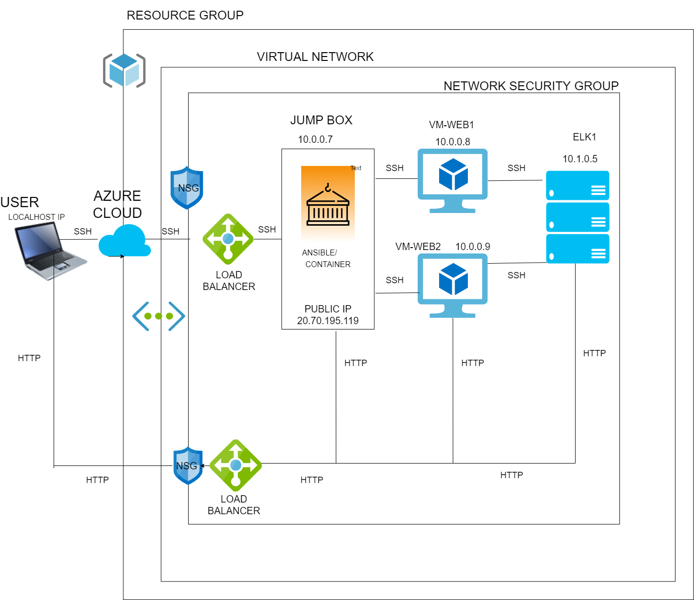

## Automated ELK Stack Deployment

The files in this repository were used to configure the network depicted below.



These files have been tested and used to generate a live ELK deployment on Azure. They can be used to either recreate the entire deployment pictured above. Alternatively, select portions of the **YAML** file may be used to install only certain pieces of it, such as Filebeat.


  **ansible/install-elk.yml**
  

This document contains the following details:
- Description of the Topology
- Access Policies
- ELK Configuration
  - Beats in Use
  - Machines Being Monitored
- How to Use the Ansible Build


### Description of the Topology

The main purpose of this network is to expose a load-balanced and monitored instance of DVWA, the D*mn Vulnerable Web Application.

Load balancing ensures that the application will be highly **effective**, in addition to restricting **access** to the network.
- _TODO: What aspect of security do load balancers protect? What is the advantage of a jump box?_


**Load balancer block excessive traffic to the server which might disturb the functions of the server or applications running.**

**As jump box act as a remote host and using SSH the remote virtual machines are connected through Jump box,which is more secure than using a virtual machine directly.**

Integrating an ELK server allows users to easily monitor the vulnerable VMs for changes to the **configuration files** and system **files**.
- _TODO: What does Filebeat watch for?_

**Filebeat is to collect,parse and visualize logs.This will helps to track the organizational goal.**

- _TODO: What does Metricbeat record?_

**Metricbeat collects the metrics and statistics from the system and the services running on the server.**

The configuration details of each machine may be found below.
_Note: Use the [Markdown Table Generator](http://www.tablesgenerator.com/markdown_tables) to add/remove values from the table_.


| Name     | Function  | IP Address | Operating System |
|----------|-----------|------------|------------------|
| Jump Box | Gateway   | 10.0.0.7   | Linux            |
| Web1     | Webserver | 10.0.0.8   | Linux            |
| Web2     | Webserver | 10.0.0.9   | Linux            |
| elk1     | Webserver | 10.1.0.5   | Linux            |
|      

### Access Policies

The machines on the internal network are not exposed to the public Internet. 

Only the  **Jump-box-provisioner**  machine can accept connections from the Internet. Access to this machine is only allowed from the following IP addresses:
- _TODO: Add whitelisted IP addresses_

Machines within the network can only be accessed by **Jumpbox**.
- _TODO: Which machine did you allow to access your ELK VM? What was its IP address?_

```bash
Web1 10.0.0.8
Web2 10.0.0.9
```


A summary of the access policies in place can be found in the table below.


| Name     | Function  | IP Address | Operating System |
|----------|-----------|------------|------------------|
| Jump Box |           |            |                  |
| Web1     |           |            |                  | 
| Web2     |           |            |                  |  
| elk1     |           |            |                  |
|

### Elk Configuration

Ansible was used to automate configuration of the ELK machine. No configuration was performed manually, which is advantageous because...
- _TODO: What is the main advantage of automating configuration with Ansible?_

``` bash
AS Ansible uses Human readable YAML templates.It is easy to do repetative tasks automatically.
```


The playbook implements the following tasks:
- _TODO: In 3-5 bullets, explain the steps of the ELK installation play. E.g., install Docker; download image; etc._
- install docker.io

- install python3-pip

- install docker python module

- Download and launch a docker web container

- configure elk vm to use more memory

- enable docker service


The following screenshot displays the result of running `docker ps` after successfully configuring the ELK instance.


### Target Machines & Beats
This ELK server is configured to monitor the following machines:
- _TODO: List the IP addresses of the machines you are monitoring_

- 10.0.0.7
- 10.0.0.8
- 10.0.0.9
- 10.1.0.5


We have installed the following Beats on these machines:
- _TODO: Specify which Beats you successfully installed_
- Filebeat
- Metricbeat


These Beats allow us to collect the following information from each machine:
- _TODO: In 1-2 sentences, explain what kind of data each beat collects, and provide 1 example of what you expect to see. E.g., `Winlogbeat` collects Windows logs, which we use to track user logon events, etc._

```bash
Filebeat monitor log files and collect log events from the specified location and forwarded for indexing.
For example like collecting windows logs.
```
```
Metricbeat collects metrics and statistics from the server.
example from apache server.
```


### Using the Playbook
In order to use the playbook, you will need to have an Ansible control node already configured. Assuming you have such a control node provisioned: 

SSH into the control node and follow the steps below:
- Copy the **ansible host** file to  **run playbooks**.
- Update the **ansible host** file to include...
- Run the playbook, and navigate to **Jumpbox** to check that the installation worked as expected.

_TODO: Answer the following questions to fill in the blanks:_
- _Which file is the playbook? Where do you copy it?_

```
.yml files in the YAML format are playbooks.
Which is ansible's code language used to run repetative tasks .
```


- _Which file do you update to make Ansible run the playbook on a specific machine? How do I specify which machine to install the ELK server on versus which to install Filebeat on?_
- _Which URL do you navigate to in order to check that the ELK server is running?

_As a **Bonus**, provide the specific commands the user will need to run to download the playbook, update the files, etc._
